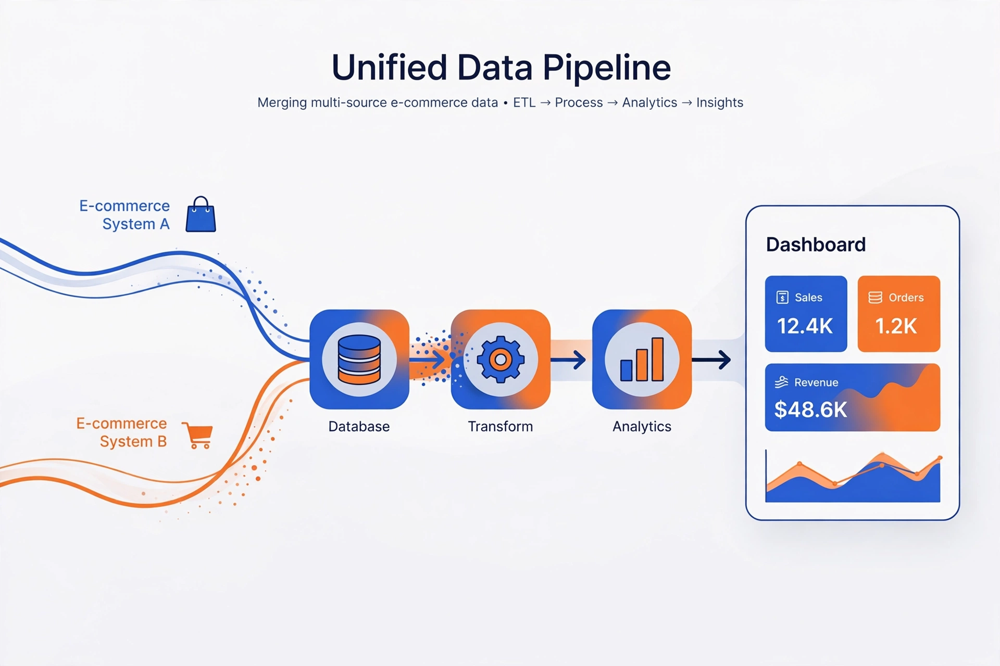

# 🔗 Unified Commerce Data Pipeline: End-to-End Analytics Platform for Multi-Source E-Commerce Data



_Reconciling messy, real-world commerce data into a clean, tested, business-ready warehouse, built to mirror how a production analytics team actually works._

---

## 🧩 Overview

**Unified Commerce Data Pipeline** is an end-to-end analytics platform that ingests order data from two simulated source systems, a legacy point-of-sale system and a modern web platform, and reconciles them into a single, clean, tested data warehouse ready for business intelligence.

The project intentionally reproduces the kind of data quality problems every real analytics team eventually inherits: duplicate records from a retry bug, inconsistent date formats across systems, orphaned foreign keys from service sync lag, and late-arriving data. Every one of these issues is diagnosed, fixed, and documented below, rather than avoided by using a clean, pre-packaged dataset.

The full stack spans ingestion, transformation, orchestration, distributed processing, and business intelligence: **PostgreSQL → dbt → Apache Airflow → PySpark → Tableau / Excel**.

---

## 🎯 The Problem

> How do you turn two disagreeing, imperfect source systems into a single source of truth that a business can actually trust and query?

Most portfolio projects start from a clean CSV. Real companies don't have that luxury: different systems write dates differently, retries create duplicate records, and services drift out of sync with each other. This project treats that mess as the starting point, not an inconvenience to clean away in a notebook, and builds a pipeline robust enough to catch and resolve it automatically, every time it runs.

---

## 💡 Motivation

A dashboard is only as trustworthy as the pipeline feeding it. An analyst who can build a chart is common; an analyst who can look at a warehouse table and say _"this number is wrong, and here's exactly why"_ is far rarer, and far more valuable to a hiring manager.

This project was built to demonstrate that second skill directly: every data quality issue below was actually encountered during the build, diagnosed using real row counts and real test failures, and fixed in a way that's documented and reproducible.

---

## 🧬 Core Idea

The pipeline follows a standard modern ELT architecture:

1. **Generate** realistic, deliberately imperfect synthetic e-commerce data (Python)
2. **Load** raw data as-is into a Postgres landing zone (Python + psycopg2)
3. **Transform** through staging, intermediate, and mart layers with automated tests (dbt)
4. **Orchestrate** the full pipeline on a schedule, with retries and failure alerting (Apache Airflow, Dockerized)
5. **Process** heavier aggregations using distributed computing (PySpark)
6. **Visualize** business KPIs for two different audiences (Tableau Public dashboard, Excel executive workbook)

---

## 🧠 Why It Matters

- Demonstrates the full analyst-to-analytics-engineer skill spectrum: SQL modeling, Python scripting, workflow orchestration, distributed processing, and stakeholder-facing BI, in one coherent project rather than five disconnected ones.
- Every data quality issue is caught by an automated test, not eyeballed in a spreadsheet, mirroring how production data teams actually maintain trust in their numbers.
- The BI layer includes genuine analytical insight (a margin vs. revenue finding invisible in a plain bar chart), not just default charts dropped onto a canvas.

---

## 🧰 Tools and Technologies

| Category                   | Stack                                                                   |
| -------------------------- | ----------------------------------------------------------------------- |
| **Database & Warehousing** | PostgreSQL 14.19                                                        |
| **Transformation**         | dbt-core 1.8.2 (staging → intermediate → marts, with automated testing) |
| **Orchestration**          | Apache Airflow 2.9.3, Dockerized (LocalExecutor)                        |
| **Distributed Processing** | PySpark 3.5.1, JDBC (Postgres connector)                                |
| **Languages**              | Python (pandas, psycopg2), SQL                                          |
| **Business Intelligence**  | Tableau Public, Excel (formula-driven executive workbook)               |
| **Containerization**       | Docker, Docker Compose                                                  |
| **Version Control**        | Git, GitHub                                                             |

---

## 🧩 Methodology

### Phase 1. Synthetic Data Generation

Generated 2,000 customers, 150 products, and 60,547 raw orders across two simulated source systems, with deliberately injected, documented messiness:

```python
# legacy_pos writes MM/DD/YYYY, web_platform writes ISO YYYY-MM-DD
# ~2.5% of legacy_pos orders duplicated (simulated retry-bug)
# ~1% of web_platform orders reference a nonexistent customer/product
# ~3% of records arrive more than 30 days after their order_date
```

### Phase 2. Raw Load to PostgreSQL

Raw CSVs loaded as-is into a `raw` schema landing zone via a Python extraction script using `COPY`, with row-count validation logging after every load so a partial or failed load is never silent.

### Phase 3. Transformation with dbt

Built a three-layer dbt project:

- **Staging**: standardizes date formats across source systems, dedupes the retry-bug orders using a `ROW_NUMBER()` window function
- **Intermediate**: joins orders to dimensions, explicitly flags orphaned foreign key records rather than silently dropping or silently keeping them
- **Marts**: `dim_customers`, `dim_products`, `fct_orders`, and `mart_monthly_kpis`, with a deliberate denormalization tradeoff (see below)

**8 models, 17 automated tests, 100% passing.**

### Phase 4. Orchestration with Airflow

A four-task DAG (`load_raw_data → dbt_run → dbt_test → pyspark_revenue_trends`) running in Docker, with retry logic and failure logging. Each task only proceeds if the previous one succeeded, so a broken run stops before bad data reaches the marts.

### Phase 5. Distributed Processing with PySpark

A dedicated Spark job reads `fct_orders` via JDBC, aggregates to daily revenue, and computes rolling 7-day and 30-day revenue trends using window functions, then writes the result back to Postgres as a queryable table. This is the kind of sliding-window computation across a full order history that stops being practical in plain SQL at real scale.

### Phase 6. Business Intelligence

- **Tableau Public dashboard**: KPI scorecard, a margin-vs-revenue analysis exposing profitability patterns invisible in simple bar charts, a region × category revenue heatmap, and the PySpark rolling trend
- **Excel executive workbook**: formula-driven (SUMIF/INDEX-MATCH, not hardcoded values) summary built for stakeholders who live in spreadsheets, not BI tools

---

## 🔍 Data Quality Issues Found & Resolved

| Issue                                                                                              | How It Was Caught                                                                                                                                     | Resolution                                                                                                       |
| -------------------------------------------------------------------------------------------------- | ----------------------------------------------------------------------------------------------------------------------------------------------------- | ---------------------------------------------------------------------------------------------------------------- |
| Duplicate orders from a legacy_pos retry bug (547 records)                                         | `unique` test on `order_id` failing in raw data                                                                                                       | `ROW_NUMBER()` dedup in staging, keeping earliest occurrence                                                     |
| Two incompatible date formats across source systems                                                | Manual inspection during staging model design                                                                                                         | Conditional `TO_DATE()` parsing by `source_system`                                                               |
| Orphaned foreign keys: orders referencing nonexistent customers/products (~750 records)            | `relationships` test failures on `fct_orders`                                                                                                         | Explicitly flagged in the intermediate layer, filtered from marts, count preserved for auditability              |
| Late-arriving records (1,853 orders landing >30 days after order date)                             | Custom flag comparing `order_date` to `load_timestamp`                                                                                                | Retained (not dropped) and flagged with `is_late_arriving`, since late data is a reporting concern, not a defect |
| dbt-core silently resolved to an unreleased 2.0 alpha ("dbt Fusion") that doesn't support Postgres | `dbt run` failing with `InvalidConfig` on a fresh Docker build                                                                                        | Pinned `dbt-core==1.8.2` explicitly alongside `dbt-postgres`                                                     |
| Non-idempotent raw load: re-running the pipeline silently duplicated rows on every trigger         | Every uniqueness test failing simultaneously after repeated Airflow runs, diagnosed via exact `Got N results` counts matching the duplication pattern | Added `TRUNCATE` before every `COPY`, making the load safe to re-run                                             |
| dbt test syntax incompatible between local dbt (1.12) and Dockerized dbt (1.8.2)                   | `dbt run` failing inside the Airflow container with a macro argument error                                                                            | Reverted to the syntax compatible with the pinned stable version                                                 |
| Hardcoded Java path broke PySpark on Apple Silicon                                                 | `JAVA_GATEWAY_EXITED` error in Airflow task logs                                                                                                      | Resolved `JAVA_HOME` dynamically at runtime instead of hardcoding an architecture-specific path                  |

---

## 📈 Business Findings

| Finding                                                                                           | Evidence                                                                                       |
| ------------------------------------------------------------------------------------------------- | ---------------------------------------------------------------------------------------------- |
| **Books drives high revenue but the lowest margin of any category**                               | Margin-vs-revenue analysis; confirmed across all 5 regions in the heatmap                      |
| **Sports & Outdoors has the highest margin despite modest order volume**                          | Sits furthest above the average-margin reference line                                          |
| **Pet Supplies is the standout performer**                                                        | Strong on both revenue and margin simultaneously                                               |
| **Books and Pet Supplies are consistently the top two revenue categories in every single region** | Cross-validated pattern in the region × category heatmap, not an artifact of one region's data |

---

## 🎨 Dashboards

**Tableau Public:** [Unified Commerce: Revenue & Margin Analysis](https://public.tableau.com/app/profile/naga.hema.ramishetty/viz/UnifiedCommerceRevenueMarginAnalysis/UnifiedCommerceRevenueMarginAnalysis)

- KPI scorecard (revenue, orders, margin, average order value)
- Margin vs. revenue by category, with an average-margin reference line
- Region × category revenue heatmap
- PySpark-computed rolling 7-day and 30-day revenue trend

**Excel:** Formula-driven executive summary workbook (`exports/unified_commerce_executive_summary.xlsx`), with KPI cards, region and category breakdowns, and top/bottom performer callouts, all built on live `SUMIF`/`INDEX-MATCH` formulas referencing raw data tabs.

---

## 🧠 Architectural Decisions & Tradeoffs

- **Denormalization in `fct_orders`**: category and region are denormalized directly into the fact table rather than kept in a strict star schema, trading a small amount of storage and staleness risk for materially faster BI dashboard queries, since these two fields are filtered on constantly. Higher-cardinality fields like customer name were deliberately left normalized.
- **Late-arriving data is flagged, not dropped**: a record arriving after its reporting period closed is a real business signal (something worth investigating upstream), not noise to discard.
- **Orphaned foreign keys are filtered with an audit trail**, not silently kept (which would inflate BI totals) or silently dropped (which would hide a real upstream data quality issue from anyone downstream).

---

## ⚠️ Limitations & Future Directions

- At significantly larger data volumes, the denormalization tradeoff in `fct_orders` would need revisiting, likely moving category/region lookups back to query-time joins with proper indexing.
- Schema drift from source systems (a renamed or dropped column) is not yet automatically detected; this would be a natural next addition to the dbt test suite.
- The pipeline currently runs on a daily schedule; a production version would benefit from event-driven triggering for the raw load step.
- PySpark is currently used for a single aggregation; at true production data volumes, more of the staging/intermediate transformation logic could reasonably move into Spark as well.

---

## 👩‍💻 Author

**Naga Hema Ramishetty**
Data Analyst
**GitHub:** [github.com/nagahemaramishetty](https://github.com/nagahemaramishetty)

---

## 🧭 Keywords

`PostgreSQL` · `dbt` · `Apache-Airflow` · `Docker` · `PySpark` · `ETL` · `ELT` · `Data-Engineering` · `Data-Quality` · `Tableau` · `Business-Intelligence` · `Data-Analyst-Portfolio`

---

_This repository demonstrates that a trustworthy dashboard starts with a trustworthy pipeline. Every number here is backed by a tested, documented, and reproducible data process._
